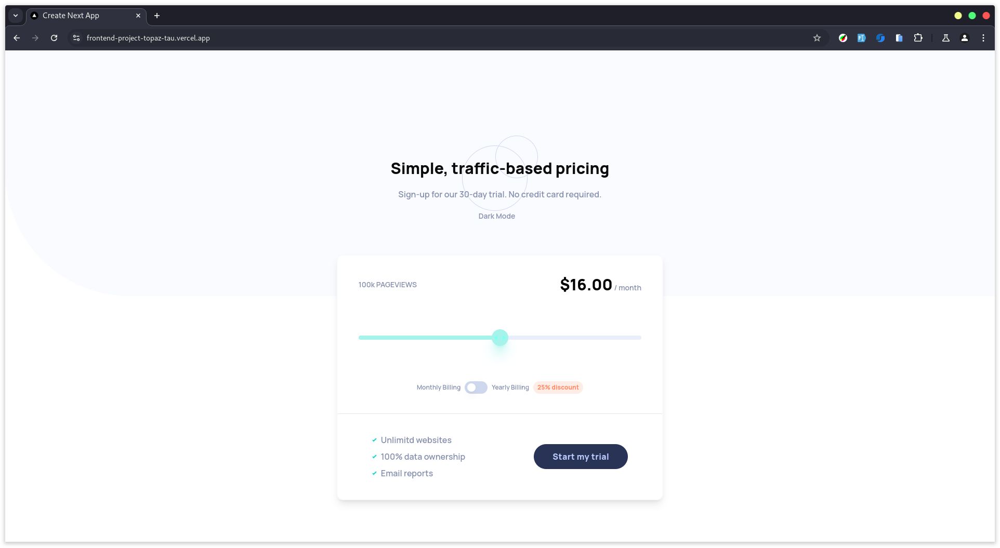
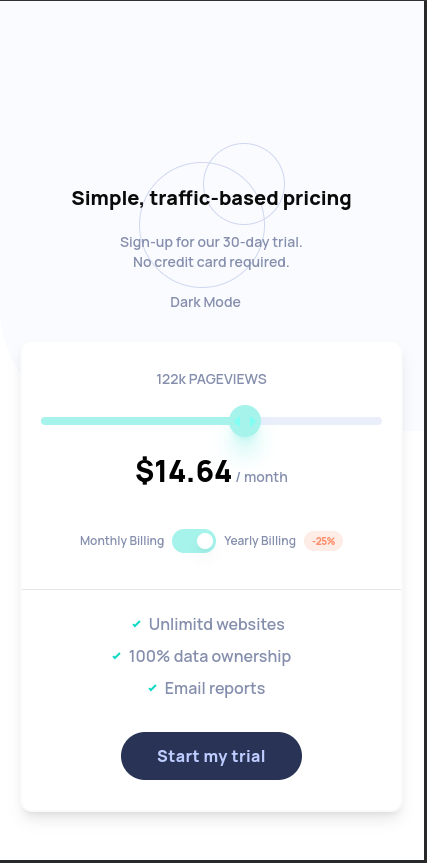
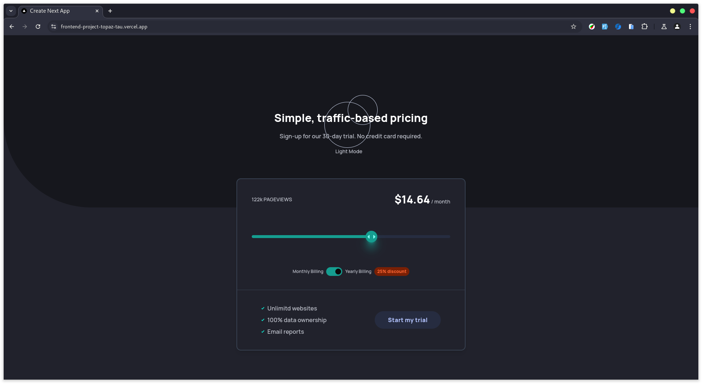
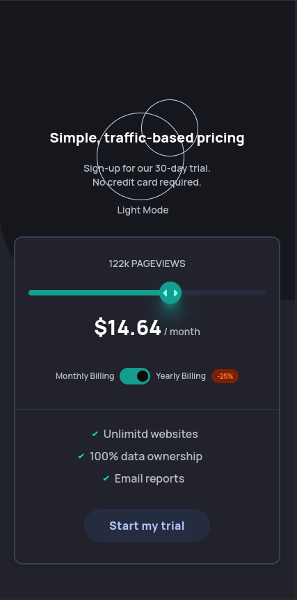

## Frontend Project


### Demo
[Here is a demo video link](https://www.loom.com/share/99f98bf1a5324d5ebf5f5a3a8e236f13?sid=62f704e3-ec38-4ac6-ab8a-9703f0d6b53c)

This site is fully responsive
[Here is a demo of the responsiveness](https://www.loom.com/share/8bcbaf3b568c4dfb8e3651080914dc05?sid=5286d89a-d24c-4523-988c-9360adf1cb00)


#### Images
light mode 

woking of function 
- slider


- toggle


- responsive


dark mode


- responsive


### Features

- Responsive Design: Works seamlessly across devices and screen sizes.
- Dark Mode Support: Custom dark theme for improved user experience.
- Dynamic Pricing Calculation: Pricing changes based on [usage/toggles/etc.].


### Installation

1. Clone this repository to your local machine:

```bash

git clone https://github.com/Prathamdas3/frontend_project.git
```

2. Navigate to the project directory:

```bash
cd frontend_project
```

3. Install the required dependencies:

```bash
npm install
```

4. Run the development server:

```bash
npm run dev
```

5. Open http://localhost:3000 in your browser to view the app.

### Technologies Used

- Frontend: Next.js, Typescript
- Styling: Tailwind CSS, Shadcn

### Contributing

Contributions are welcome! Please follow these steps:

1. Fork this repository.
2. Create a new branch: git checkout -b feature-name.
3. Make your changes and commit them: git commit -m 'Add feature'.
4. Push to the branch: git push origin feature-name.
5. Create a pull request.
